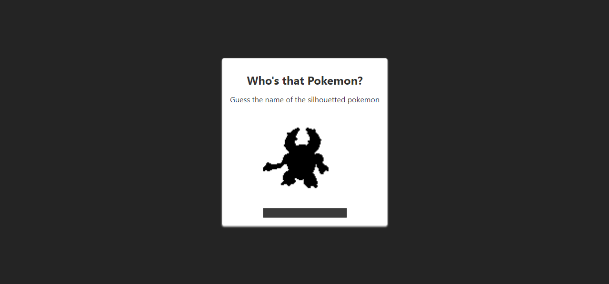

# Whos that pokemon game

This is a simple game where you have to guess the name of the pokemon based on the image.
if the name is correct it will reveal the pokemon and you will move on to the next random pokemon.
Created with Vite and React

## Screenshots

## How to play

visit the [game](https://mrdiamonddirt.github.io/whosthatpokemon/) and the game will start.

## possible improvements

- [ ] Add a timer
- [ ] Add a score
- [ ] Add Settings
- [ ] Add a leaderboard

## How to contribute

1. Fork the repo
2. Clone the repo
3. Make changes
4. Commit and push
5. Make a pull request

## How to run locally

1. Clone the repo
2. cd into the repo
3. run `npm install`
4. run `npm run dev`
